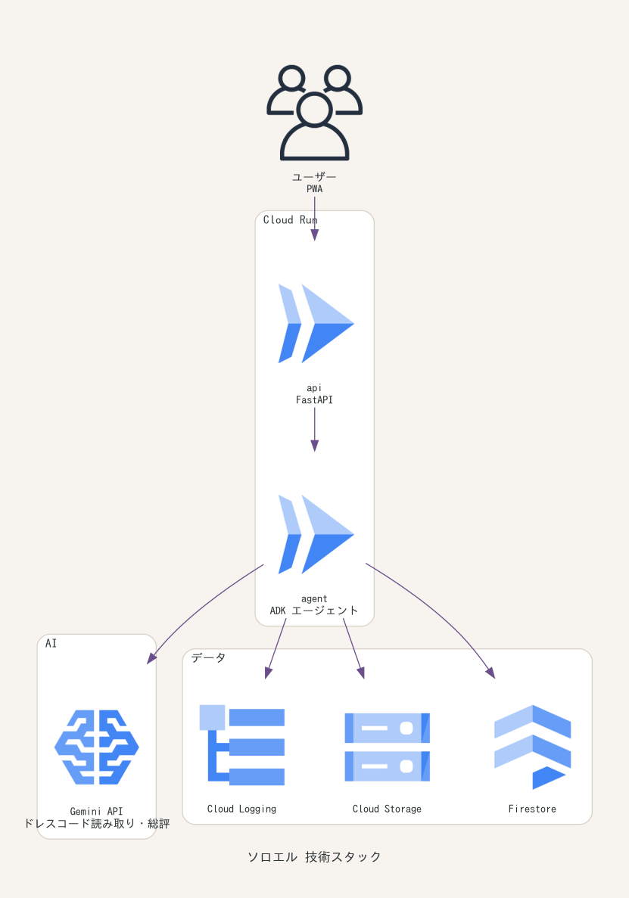

# ソロエル

グループ全員のバーチャル試着を1枚の「集合プレビュー」に合成し、衣装かぶり・浮きを事前に検知する
グループ集合試着エージェント。詳細は [設計書.md](設計書.md)。

結婚式のお呼ばれ・成人式・コスプレの合わせなど、「並んだときの見え方」を当日ではなく事前に確認できる。

## 技術スタック



## できること

- **集合プレビュー**: メンバーの試着結果を1枚に合成。同意していない人はシルエットで表示
- **かぶり検知**: 主要色の CIEDE2000 色差と柄の系統から、並んだときにかぶるペアを警告
- **浮き検知**: フォーマル度をグループ中央値と比較し、1人だけ浮く状態を検知
- **ドレスコード検証**: 結婚式の白・全身黒・ファーなど、シーン別のNGを判定
- **代替案の提示**: 他メンバーの確定色から十分離れ、ドレスコードに触れない衣装を提案
- **自律進行**: 全員確定の検知、未確定者への催促、警告の当事者への通知をエージェントが自分で行う
- **会場ライティング再現**: 「昼のガーデン」「ホテル宴会場」など式場の光でプレビューを再照明し、当日の見え方に近づける
- **記念ムービー**: 全員確定後、集合プレビューから短いムービーを生成（合意形成を祝う体験）

## 設計上の要点

- **同意ベースの合成**: 顔を合成してよいかの判定は `Member.composable` に一本化。未同意はシルエット。
  撤回すると再合成に加えて試着画像・過去プレビューの実体も削除する。
- **判定根拠の常時開示**: すべての警告が `evidence`（ΔE00 値・フォーマル度・中央値）を持つ。
  数値判定はドメイン側、Gemini は言語化のみ担当するため、LLM が落ちても警告は出続ける。
- **ルーム単位の完全消去**: ストレージは `room_id/` 配下に閉じ、`DELETE /api/rooms/{id}` と
  `POST /api/maintenance/sweep`（TTL 一括）で消える。監査ログだけは削除の証跡として残す。
- **通知はアプリ内**（`NOTIFY_CHANNEL=in_app`）。通知はルームに閉じて保持され、宛先本人しか読めない。
  外部配信に広げるときは `MessagingPort` の実装を差し替える。
- **データ管理は Firestore**。開発時もエミュレータを使い、本番と同じ経路で動かす。
  ルームは1ドキュメントに閉じているため、TTL削除と同意撤回が「そのルームを消す」だけで完結する。
- **重い処理は差し替え可能**（設計書 §12）。集合プレビューの合成と記念ムービーは
  ローカル（Pillow）で完結し、品質を上げたいときに GMI Cloud のモデルへ切り替える。
  **誰をシルエットにするかの判断は常にローカルに残す**ため、未同意の人の顔が生成される余地がない。
  外部が落ちてもローカル合成にフォールバックし、ルーム進行は止まらない。

## 主なエンドポイント

| メソッド | パス | 内容 |
|---|---|---|
| POST | `/api/rooms` | ルーム作成（幹事） |
| POST | `/api/rooms/{id}/members` | 招待URLからの参加 |
| POST | `/api/rooms/{id}/members/{uid}/consent` | 合成同意の取得・撤回 |
| POST | `/api/rooms/{id}/members/{uid}/tryon` | 個人試着（候補生成） |
| POST | `/api/rooms/{id}/members/{uid}/select` | 衣装確定 |
| GET | `/api/rooms/{id}/members/{uid}/alternatives` | 代替案 |
| GET | `/api/rooms/{id}/members/{uid}/notifications` | 本人あての通知（`?unread_only=true` で未読のみ） |
| POST | `/api/rooms/{id}/members/{uid}/notifications/read` | 既読化（ID省略で本人ぶん全件） |
| GET | `/` | 機能・使い方の紹介ページ |
| GET | `/app` | ルーム操作の画面（招待URLの遷移先） |
| GET | `/api/rooms/{id}/preview.png` | 集合プレビュー |
| POST | `/api/rooms/{id}/lighting` | 会場ライティングの設定（再合成される） |
| POST | `/api/rooms/{id}/movie` | 記念ムービーの生成（全員確定が前提） |
| GET | `/api/rooms/{id}/movie` | 記念ムービーの取得 |
| GET | `/api/rooms/{id}/audit` | 監査ログ |
| DELETE | `/api/rooms/{id}` | ルーム完全削除 |
| POST | `/api/maintenance/sweep` | TTL 到来ルームの一括削除（Cloud Scheduler 想定） |

## 動かす

```bash
docker compose up
```

http://localhost:8080 が機能・使い方の紹介ページ、`/app` がルーム操作の画面。
外部APIキーは不要（既定ですべて mock）。
データは同時に立ち上がる Firestore エミュレータに入る。

開発手順・環境変数・実装の約束ごとは [CONTRIBUTING.md](CONTRIBUTING.md)、
Cloud Run へのデプロイは [DEPLOY.md](DEPLOY.md) を参照。

## 未実装（設計書 §9 のとおり MVP 外）

- YouCam / Gemini / LINE の live 実装（ポートの口だけ用意）
- GMI Cloud の実接続（実装はあるが実キーでの疎通は未検証。既定はローカル合成）
- 記念ムービーの音楽生成（ローカルGIFは無音）
- アプリ外への通知（Web Push・LINE）。通知はアプリを開いた人にしか届かない
- 成人式・コスプレのシーンプリセット（`app/domain/dresscode.py` に枠のみ）
- 実EC連携（カタログのレンタルリンクはダミー）
