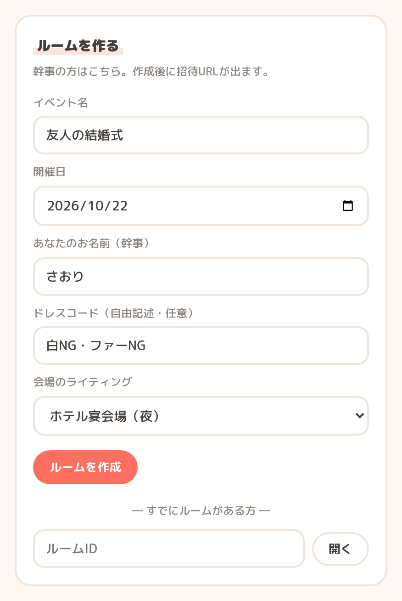
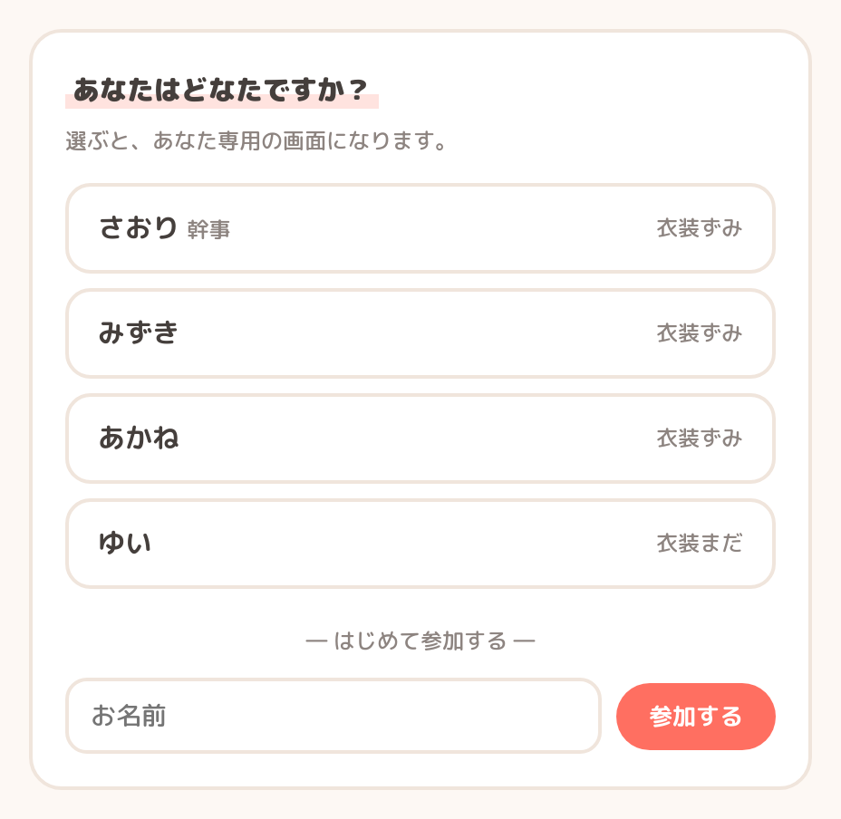
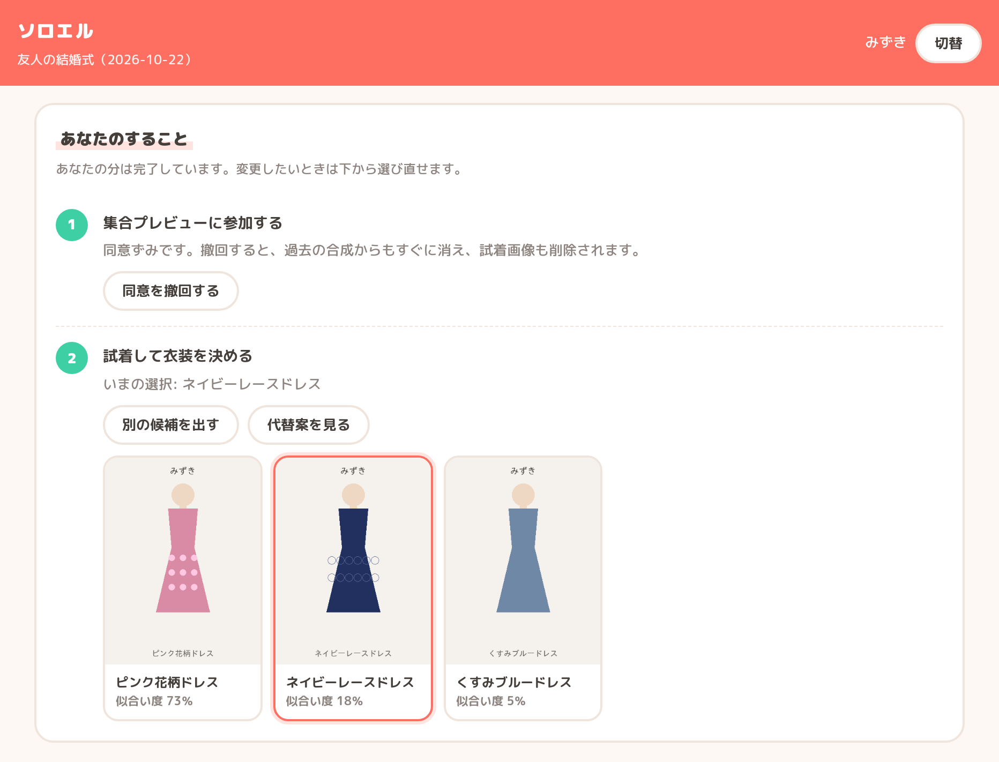
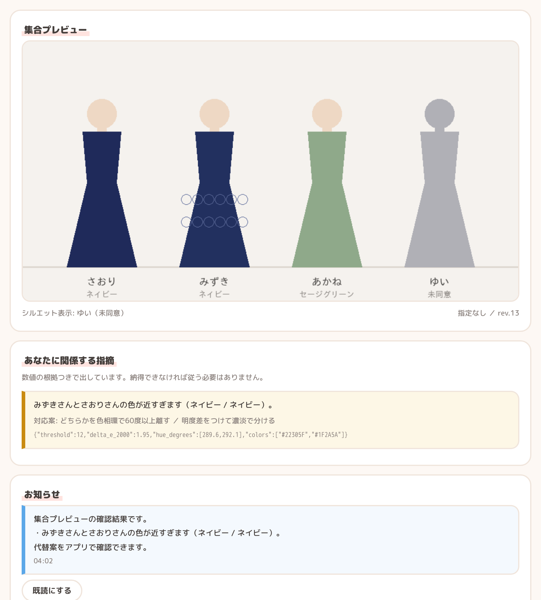
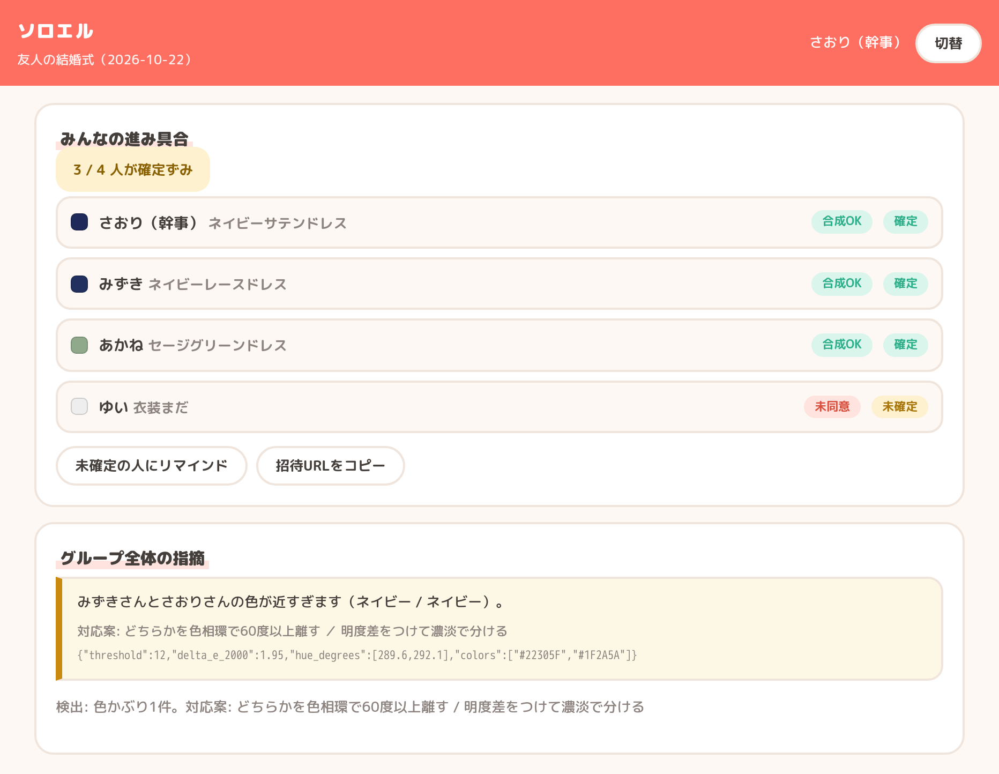
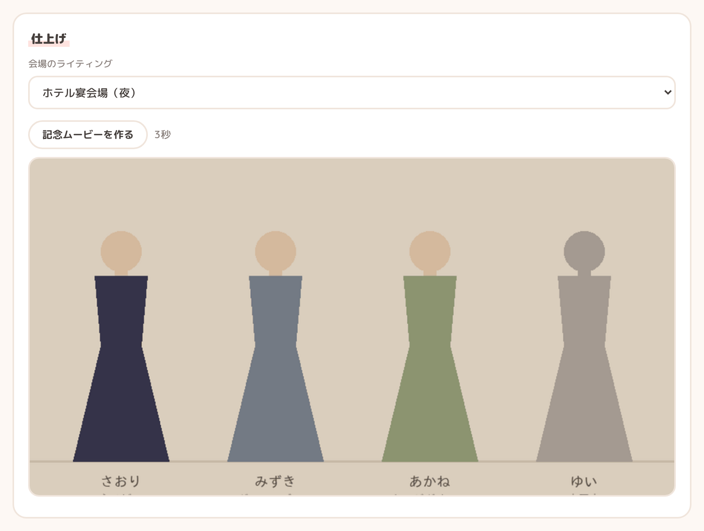

# ソロエル

グループ全員のバーチャル試着を1枚の「集合プレビュー」に合成し、衣装かぶり・浮きを事前に検知する
グループ集合試着エージェントです。

結婚式のお呼ばれ・成人式・コスプレの合わせなど、「並んだときの見え方」を当日ではなく事前に確認できます。

## 使い方 — 友人4人でお呼ばれ

さおりさんが幹事になって、4人で結婚式に出る場面です。画像はすべて実際の画面です。

### 1. 幹事がルームを作る

イベント名・開催日・ドレスコードを入れます。会場のライティングもここで選べます。



### 2. 招待URLから参加する

届いたURLを開いて、自分の名前を選ぶだけです。インストールは要りません。



### 3. 同意して、試着して決める

集合プレビューに顔を出すかは本人が決め、いつでも撤回できます。候補を試着して1着に決めます。
似合い度は並び順の目安で、「似合う / 似合わない」を断定するものではありません。



### 4. かぶりはその場で知らせる

誰かが決めるたびにプレビューが作り直され、かぶった本人にだけ色差の数値つきで届きます。
同意していないゆいさんは、シルエットのまま並びます。



### 5. 幹事は全体を見渡す

誰が未確定・未同意かが一目でわかります。未確定の人へのリマインドもここから送れます。



### 6. 全員そろったら仕上げる

会場の光に寄せて見え方を確かめ、記念ムービーを作れます。



## できること

- **集合プレビュー**: メンバーの試着結果を1枚に合成します。同意していない人はシルエットで表示します
- **かぶり検知**: 主要色の CIEDE2000 色差と柄の系統から、並んだときにかぶるペアを警告します
- **浮き検知**: フォーマル度をグループの中央値と比べ、1人だけ浮いている状態を見つけます
- **ドレスコード検証**: 結婚式の白・全身黒・ファーなど、シーンごとのNGを判定します
- **代替案の提示**: 他メンバーの確定色から十分に離れ、ドレスコードにも触れない衣装を提案します
- **自律進行**: 全員確定の検知、未確定の人への催促、警告の当事者への通知をエージェントが自分で行います
- **会場ライティング再現**: 「昼のガーデン」「ホテル宴会場」など式場の光でプレビューを再照明し、当日の見え方に近づけます
- **記念ムービー**: 全員が確定したあと、集合プレビューから短いムービーを作ります

## 技術スタック


## 設計上の要点

- **同意ベースの合成**: 顔を合成してよいかの判定は `Member.composable` に一本化しています。未同意の人はシルエットになります。
  撤回すると再合成に加えて、試着画像と過去のプレビューの実体も削除します。
- **判定根拠の常時開示**: すべての警告が `evidence`（ΔE00 の値・フォーマル度・中央値）を持ちます。
  数値の判定はドメイン側で行い、Gemini は言語化だけを担当するため、LLM が落ちても警告は出続けます。
- **ルーム単位の完全消去**: ストレージは `room_id/` の配下に閉じており、`DELETE /api/rooms/{id}` と
  `POST /api/maintenance/sweep`（TTL の一括削除）で消えます。監査ログだけは削除の証跡として残します。
- **通知はアプリ内です**（`NOTIFY_CHANNEL=in_app`）。通知はルームに閉じて保持され、宛先の本人しか読めません。
  外部配信に広げるときは `MessagingPort` の実装を差し替えます。
- **データ管理は Firestore です**。開発時もエミュレータを使い、本番と同じ経路で動かします。
  ルームは1ドキュメントに閉じているため、TTL 削除と同意撤回は「そのルームを消す」だけで完結します。
- **集合プレビューの合成と記念ムービーはローカルで完結します**。Pillow で描画し、
  会場ライティングも色調で近似します。外部の生成モデルに渡さないため、
  **未同意の人の顔が生成される余地がありません**。より質の高い実装に差し替えるときも
  `CompositorPort` / `VideoPort` の裏で閉じます。
- **顔写真は受け取りません。** 個人試着もローカルの描画で完結するため、アプリに写真を
  上げる導線そのものがありません。外部の試着エンジンを足すときも、送ってよいのは本人の分だけで、
  集合プレビュー（他人が写る画像）は外に出しません。

## 主なエンドポイント

| メソッド | パス | 内容 |
|---|---|---|
| POST | `/api/rooms` | ルーム作成（幹事） |
| POST | `/api/rooms/{id}/members` | 招待URLからの参加 |
| POST | `/api/rooms/{id}/members/{uid}/consent` | 合成同意の取得・撤回 |
| POST | `/api/rooms/{id}/members/{uid}/tryon` | 個人試着（候補生成） |
| POST | `/api/rooms/{id}/members/{uid}/select` | 衣装確定 |
| GET | `/api/rooms/{id}/members/{uid}/alternatives` | 代替案 |
| GET | `/api/rooms/{id}/members/{uid}/notifications` | 本人あての通知（`?unread_only=true` で未読のみ） |
| POST | `/api/rooms/{id}/members/{uid}/notifications/read` | 既読化（ID省略で本人ぶん全件） |
| GET | `/` | 機能・使い方の紹介ページ |
| GET | `/app` | ルーム操作の画面（招待URLの遷移先） |
| GET | `/api/rooms/{id}/preview.png` | 集合プレビュー |
| POST | `/api/rooms/{id}/lighting` | 会場ライティングの設定（再合成される） |
| POST | `/api/rooms/{id}/movie` | 記念ムービーの生成（全員確定が前提） |
| GET | `/api/rooms/{id}/movie` | 記念ムービーの取得 |
| GET | `/api/rooms/{id}/audit` | 監査ログ |
| DELETE | `/api/rooms/{id}` | ルーム完全削除 |
| POST | `/api/maintenance/sweep` | TTL 到来ルームの一括削除（Cloud Scheduler 想定） |

## 動かす

```bash
docker compose up
```

http://localhost:8080 が機能・使い方の紹介ページ、`/app` がルーム操作の画面です。
外部APIのキーは要りません（既定ですべて mock で動きます）。
データは同時に立ち上がる Firestore エミュレータに入ります。

開発手順・環境変数・実装の約束ごとは [CONTRIBUTING.md](CONTRIBUTING.md) を参照してください。

## 未実装（MVP 外）

- LINE 通知の live 実装（ポートの口だけ用意しています）
- 実写のバーチャル試着（現状は衣装の色・柄からイラストを描いています）
- 生成モデルによる高品質な集合プレビューの合成（現状は Pillow で描画しています）
- 記念ムービーの音楽生成（GIF は無音です）
- アプリ外への通知（Web Push・LINE）。通知はアプリを開いた人にしか届きません
- 成人式・コスプレのシーンプリセット（`app/domain/dresscode.py` に枠だけあります）
- 実EC連携（カタログのレンタルリンクはダミーです）
